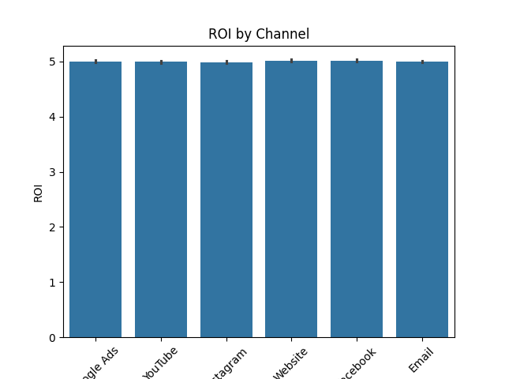
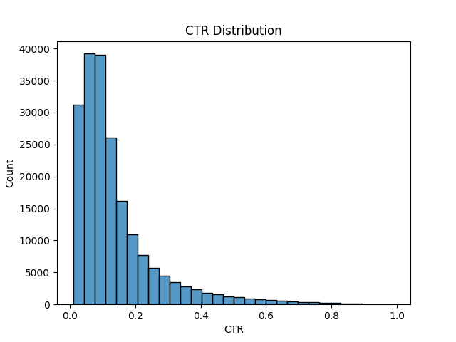
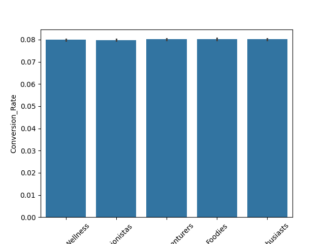
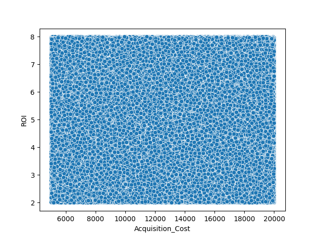
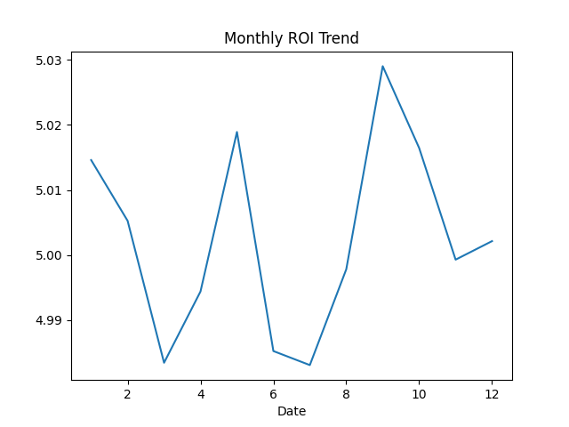

# 📊 Marketing Campaign Analysis

## 📌 Objective

Analyze marketing campaign performance to identify high-performing channels and optimize ROI.

---

## 🛠️ Tools Used

* Python (Pandas, NumPy)
* Data Visualization (Matplotlib, Seaborn)

---

## 📂 Dataset

Marketing campaign dataset containing:

* Impressions
* Clicks
* Conversion Rate
* ROI
* Acquisition Cost
* Channel, Campaign Type, Customer Segment
* Note: Original dataset was large, so a sample dataset is used here.

---

## 📈 Key Analysis

* ROI comparison across marketing channels
* Campaign type performance
* Customer segment behavior
* CTR (Click Through Rate) analysis

---

## 💡 Key Insights

* Identified top-performing marketing channels
* High engagement does not always mean high ROI
* Customer segments respond differently to campaigns
* Cost optimization opportunities found

---

## 📊 Key Visual Insights

### 1. ROI by Channel

This chart shows which marketing channel delivers the highest return.

---

### 2. CTR Distribution

This helps understand engagement spread across campaigns.

---

### 3. Conversion Rate by Segment

Different customer segments behave differently.

---

### 4. ROI vs Acquisition Cost

This shows whether higher spending leads to better returns.

---

### 5. Monthly ROI Trend

This helps identify performance trends over time.

---

## ▶️ How to Run

1. Clone the repo
2. Install dependencies:
   pip install -r requirements.txt
3. Open Jupyter Notebook
4. Run all cells

---

## 📁 Project Structure

* data/
* notebooks/
* images/

---

## 🚀 Future Improvements

* Add A/B testing
* Build dashboard (Tableau/Power BI)
* Predictive modeling for campaign success
