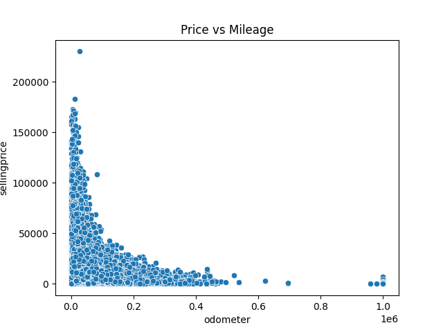
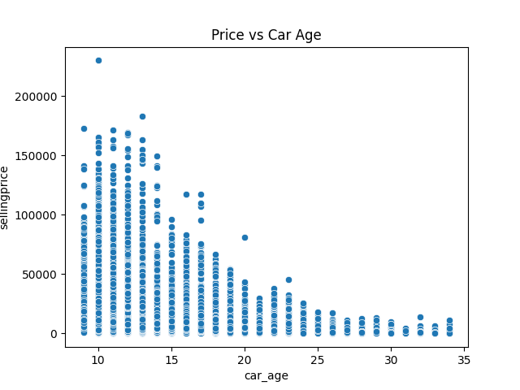
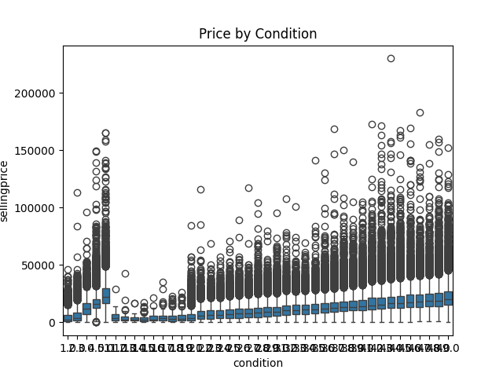
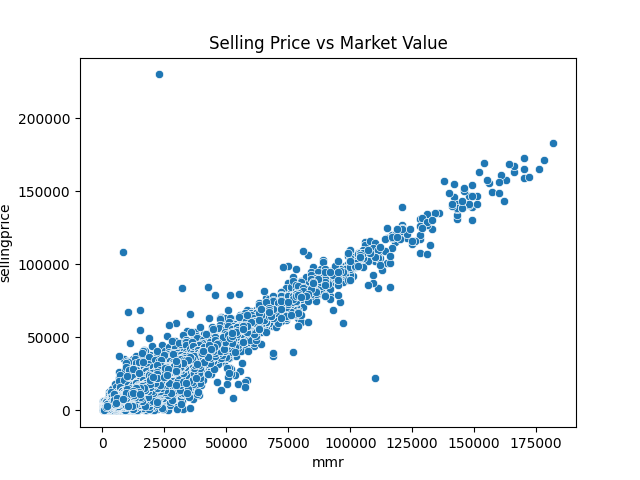

# 💰 Pricing Strategy Analysis (Car Prices Dataset)

## 📌 Objective

The objective of this project is to analyze how different factors such as mileage, age, condition, and market value affect car prices, and to derive insights that can help in making better pricing decisions.

---

## 📂 Dataset

The dataset contains information about used car sales, including:

* Selling Price
* Market Value (MMR)
* Odometer (Mileage)
* Car Condition
* Year of Manufacture
* Brand and Model

⚠️ Dataset is not included in this repository due to size limitations.

---

## 🛠️ Tools & Technologies

* Python
* Pandas & NumPy (Data Analysis)
* Matplotlib & Seaborn (Visualization)
* Jupyter Notebook

---

## 📊 Key Analysis Performed

* Data Cleaning and Preprocessing
* Feature Engineering (Car Age, Price Difference)
* Exploratory Data Analysis (EDA)
* Correlation Analysis
* Pricing Pattern Identification

---

## 📊 Key Visual Insights

### 1. Price vs Mileage



Higher mileage vehicles tend to have lower selling prices.

---

### 2. Price vs Car Age



Older cars generally have lower resale value.

---

### 3. Price by Condition



Cars in better condition are priced significantly higher.

---

### 4. Price vs Market Value (MMR)



Shows how selling prices compare with market benchmarks (overpriced vs underpriced).

---

## 💡 Key Insights

* Selling price decreases as mileage increases
* Older cars tend to have lower prices
* Better condition significantly increases car value
* Selling price is closely aligned with market value (MMR)
* Some vehicles are priced above or below market benchmarks

---

## 🏁 Conclusion

Car pricing is strongly influenced by mileage, age, condition, and market value. Understanding these factors helps in setting competitive and profitable pricing strategies.

---

## ▶️ How to Run

1. Clone the repository
2. Install dependencies:

   ```
   pip install -r requirements.txt
   ```
3. Open the notebook:

   ```
   notebooks/pricing_analysis.ipynb
   ```

---

## 🚀 Future Improvements

* Build a price prediction model (Machine Learning)
* Add interactive dashboards (Tableau / Power BI)
* Perform time-based pricing trend analysis

---
